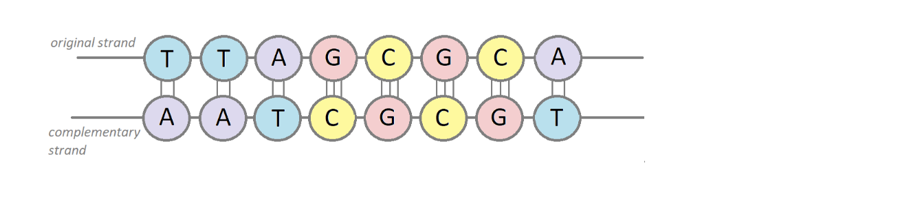
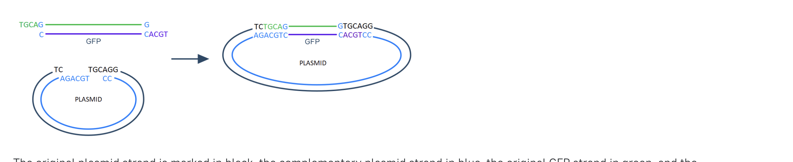

# Create Glowing Bacteria

## A complementary strand

### Description
To give the bacteria new properties, we have to start by modifying the plasmid.

Typically, a bacterial plasmid looks like a huge four-letter text (A, T, C, G). It has a header denoted by the symbol ">", in which you can find a description of the organism and key information about the sequence. Everything else is the sequence itself.

>MK753227.1 Escherichia coli str. K-12, partial sequence
GACGTCTGTGCAAGTACTACTGTTCTGCAGTCACTTGAATTCGATACCCAGCTGTGTGCACTACCTCCTT
GGTTGTCTATGCTATGCTGATCTACAACTGGCATGCGGTCAGTGCGTCCTGCTGATGTGCTCAGTATCTC
TATCACTGATAGGGATGTCAATCTCTATCACTGATAGGGAAACGTTTCGCAGAAGCTTCCGCAAGGTACC
...
Now you are looking at a sequence of a bacterial plasmid. Alas, it's just a single strand (single DNA chain). Before modification, we need to create a second complementary strand. To get it, replace each element of the original sequence with its opposite according to the complementarity principle:

Adenine (A) <-> Thymine (T);
Cytosine (C) <-> Guanine (G).

For instance, if the sequence is TTAGCGCA your answer should be AATCGCGT.

### Objectives
At this stage, you will create the complementary plasmid strand. Use only the first line of the plasmid sequence above. It looks as follows:

GACGTCTGTGCAAGTACTACTGTTCTGCAGTCACTTGAATTCGATACCCAGCTGTGTGCACTACCTCCTT
Input the sequence of the original strand;
Print the complementary strand as an answer.
Hint

### Example
The greater-than symbol followed by a space (> ) represents the console input.

> TTAGCGCA
AATCGCGT # the output starts here

## Part 4 It's sticking time
Description
You have the plasmid, and you have the GFP gene... Boom! The ligation has begun.
Ligation is the process of gluing the complementary sticky ends together. It's time to insert the GFP with the sticky ends into the gap in the plasmid.

Objective
Compose the function that performs the ligation. It should get the sequence of the plasmid with the sticky ends and the sequence of the GFP gene (with the sticky ends as well) from the file. Each GFP sticky end is complementary to the appropriate plasmid end. The function "stitches" the GFP and plasmid together by gluing the sticky ends.

To better understand the process take a look at the picture below:

The original plasmid strand is marked in black, the complementary plasmid strand in blue, the original GFP strand in green, and the complementary GFP strand in purple.

To complete the stage, your program should:

Take the file's name as input from the console and parse its contents;
Perform the ligation by gluing each complementary plasmid end with the complementary GFP end. At this step, we recommend that you implement a function that returns the double-stranded ligation result so you can reuse it in the last stage;
Print the double-stranded ligation result. Separate two sequences with a newline character (\n).
Additionally, we would like you to familiarize an input file structure:

The first line contains four parts: the first two are the original plasmid strand (the second part has the sticky end), and the last two belong to the complementary plasmid strand (the first part with the sticky end).
The second line contains two parts. The first part is the original GFP strand (sticky end on the left), and the last part is the complementary strand (sticky end on the right).
You have an example file example.txt. Use it to test that your program takes a file name as input and processes it correctly.

Example
The greater-than symbol followed by a space (> ) represents the console input.

Example 1:

example1.txt file content

ATCGTTCGTGTGCATGT TGCATCTGTATCTAGCGC TAGCAAGCACACGTACAACGT AGACATAGATCGCG
TGCAXXXXXXXXXXXXX XXXXXXXXXXXXXACGT
The output of your program

> example1.txt
ATCGTTCGTGTGCATGTTGCAXXXXXXXXXXXXXTGCATCTGTATCTAGCGC
TAGCAAGCACACGTACAACGTXXXXXXXXXXXXXACGTAGACATAGATCGCG